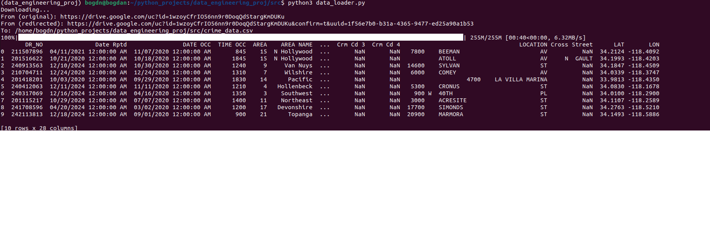

# DATA_ENGINEERING_PROJ
## DATA DESCRIPTION
Data represents a list of crimes that has been comitted in New-York from 2020 till present.
Purpose of this project is to analyze the data structure, validate the structure, transform it to more sufficient way to store(data base and .parquet) for further steps for extracting logic-value from clean data.
Below, a table is represented, that shows columns, their type and some description about each. 
    
Link to the data: https://drive.google.com/file/d/1GAFf1P8SRlm_NM77FwquFAQw1YLF5jBo/view?usp=drive_link

| Old name of column | New name of column     | Type of data in pandas | Description |
|------------------|--------------------------|------------------------|-------------|
| DR_NO            | dr_no              | Int64               | Unique ID of case |
| Date Rptd        | date_reported      | datetime64[ns]      | Date of register in DB |
| DATE OCC         | date_occured       | datetime64[ns]      | Date of commiting crime |
| TIME OCC         | time_occured       | datetime.time       | Time of commiting crime (hours:minutes) |
| AREA             | area               | Int64               | Code of police district |
| AREA NAME        | area_name          | string              | Name of police district |
| Rpt Dist No      | report_dist_no     | Int64               | Report district number |
| Part 1-2         | part               | Int64               | Degree of severity (Part 1 or Part 2) |
| Crm Cd           | crime_code         | Int64               | Main code if crime |
| Crm Cd Desc      | crime_desc         | string              | Crime description |
| Mocodes          | mocodes            | string              | Code of methods commiting crime |
| Vict Age         | victim_age         | Int64               | Age victim |
| Vict Sex         | victim_sex         | string              | Sex victim (M/F/X) |
| Vict Descent     | victim_descent     | string              | Ethnos |
| Premis Cd        | premis_code        | float64             | Code of place commiting |
| Premis Desc      | premis_desc        | string              | Desc of place commiting|
| Weapon Used Cd   | weapon_code        | float64             | Code of weapon (if used) |
| Weapon Desc      | weapon_desc        | string              | Weapon descript |
| Status           | status             | string              | Code status |
| Status Desc      | status_desc        | string              | Description status |
| Crm Cd 1         | crime_code_1       | float64             | Additional code of crime №1 |
| Crm Cd 2         | crime_code_2       | float64             | Additional code of crime №2 |
| Crm Cd 3         | crime_code_3       | float64             | Additional code of crime №3 |
| Crm Cd 4         | crime_code_4       | float64             | Additional code of crime №4 |
| LOCATION         | location           | string              | Address and description of place crime commited |
| Cross Street     | cross_street       | string              | Cross street (if is there) |
| LAT              | latitude           | float64             | Latitude |
| LON              | longitude          | float64             | Longitude |

## CONFIGURING
In this project manager miniconda is used.
File requirements.txt contains all required components to run program. 
By using miniconda you can easily download all.
<pre> 1. conda create --name 'your_project_name' </pre> By this line you created virtual env with that name.
<pre> 2. conda activate 'your_project_name' </pre> By this line you activate your created virutal env.
<pre> 3. conda config --add channels conda-forge </pre> One library "gdown" which is required to download big files from google drive requires another source.
<pre> 4. conda install --yes --file requirements.txt </pre> By this line you install all dependencies
<pre> 5. conda env config vars TABLE_NAME='your' DB_USER='your' DB_PASS='your' DB_HOST='your' DB_PORT='your' </pre> For using ETL script you will need to init your variables in virtual enviroments.
<pre> 6. conda deactivate </pre> By this line of code you disable your virtual env.

__OR__

You can use a config.sh, that in etl directory is placed.

## ENABLE ETL SCRIPT
> **NOTE: :warning:**
> src dir of this repository contains code that has been used for primary downloading and loading data, it is an outdated version but it can show evolution of the project. __ETL script__ itself is 
> placed in __etl__ dir of this repository.

__Structure of the project__
```
├── api - API of GitHub has been used for learning purpose.
├── src - Contains primary code of the ETL script.
├── images - Contains images.
├── notebooks - Contains jupyter notebook, that describes __data__ and shows how to clean it, make it valid and etc. __NOTE:__ All description in Russian language.
├── README.md - Contains information about project and instructions to start project on your own machine. 
└── etl - Contains code of ETL script.
    ├── main.py - Main block of script that reads command arguments and calls other functions.
    ├── extract.py - This block of script is responsible for extracting data from google drive and writing *.csv file on machine.
    ├── transform.py - This block of script is responsible for transforming types of data of each columns and also here a rename of columns happens.
        ├── validate.py - This block of script is responsible for validating data, it drops unuseful columns __(read notebook)__.
    ├── load.py - This block of script is responsible for loading 100 rows of data to data base and also for writing *.parquet file on machine.
```
To call help function of the script you will need to put first argument.
```
python3 etl/main.py --help
```
To call script that only downloads file from google drive write this:
```
python3 etl/main.py ext 'YOUR_FILE_ID_FROM_GOOGLE_DIRVE'
```
To call script that downloads file from google drive, makes all transformations for .parquet file, loads data to data base write this:
__NOTE__: If you want to write to original db write orig as third argument or write test to write to test db. 
```
python3 etl/main.py all 'YOUR_FILE_ID_FROM_GOOGLE_DIRVE' orig or test
```
__EXAMPLES__
Number of file doesn't exist, this example just should show how to call ETL script. 
```
python3 etl/main.py all 1jfu38JHHhfkkdbHUHbnfbD0 orig
```
```
python3 etl/main.py ext 1jfu38JHHhfkkdbHUHbnfbD0
```

<p align="center">First 10 lines of data</p>


---
## Notebooks

In that dir jupyter notebooks is found. EDA has been performed in order to make the data clean and meet requirments.
And also some estimations of data has been made. All that is in Russia language. Also in the end of the EDA has been added new plots by using Seaborn.

## Loading to database

In src/ there is a script write_to_db.py

<pre> python3 write_to_db.py </pre> 
By this line you can load your processed data to DB. Howver tou need to have virtual enviroment variables defined
such as __DB_USER__, __DB_PASS__, __DB_HOST__, __DB_PORT__.


 
